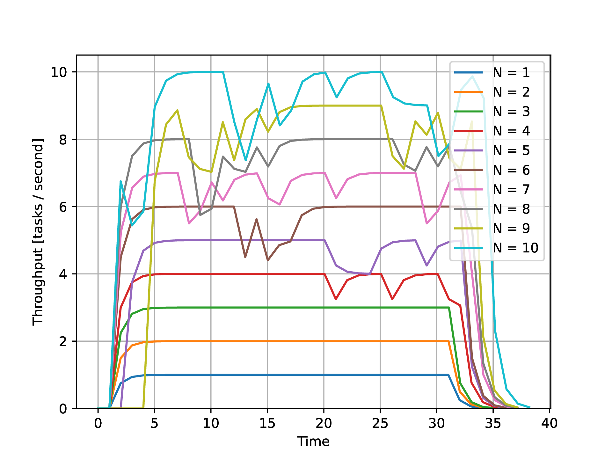
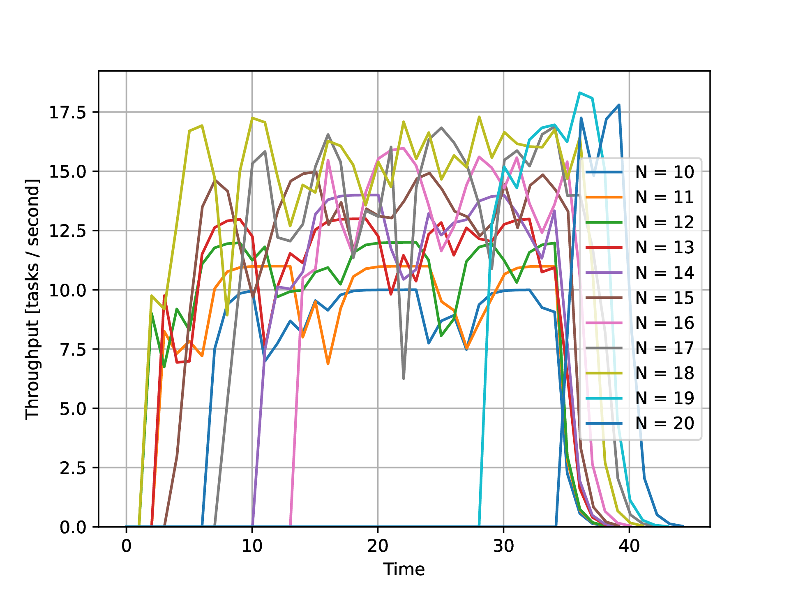

Distribute challenge
====================

`distribute_challenge` is a Python package that let's you run your function
over a remote cluster. It is an implementation of [Neuro's][neuro] [distribute
challenge][challenge].

```python
>>> from distribute_challenge import compute_this
>>> @compute_this()
... def func(x):
...     return x*x
...
>>> func(2).compute()
4
```

The `compute` call pushes the function and arguments on to a job queue which is
monitored by the workers in the cluster. The first available worker pops jobs
off the queue and the result is returned to the original caller.

[](https://github.com/alexpearce/distribute-challenge/actions/workflows/tests.yml)

## Features

- Execution backend choices. Defaults to Celery to distribute work, but can be
  extended to support multiprocessing on the same machine.
- User friendly. Validates that distributed function is compatible with the
  arguments that will be passed to it, avoiding costly round-trips which would
  anyhow fail.

**Note**: because this library serialises arbitrary Python callables it should
only be used when you can trust the client.

## How it works

1. Python functions are serialised using [`cloudpickle`][cloudpickle].
2. Serialised functions and their arguments are passed to an execution backend.

The local backend just executes the function directly within the client
process.

The [Celery][celery] backend is more interesting:

1. Serialised functions and their arguments are pushed on to a task queue
   (configured to be a [Redis][redis] instance by default).
2. Celery workers pop tasks off the queue and run them.
3. Workers push function results back to the original caller via a result
   backend (also Redis by default).

## Development

Package development is done using [Poetry][poetry]. Once you have that
installed, clone the repository and install the package and its dependencies:

```
$ poetry install
```

If you're using the [Conda][conda] package management system you can create the
base environment from the configuration provided before running Poetry:

```
$ conda env create -f environment.yaml
$ poetry install
```

Running the test suite also generates a coverage report, which is required to
be 100% for the tests to pass:

```
$ poetry run pytest --doctest-modules --cov
```

Some tests require a Celery worker instance and an associated message
queue/result backend. The [Docker compose][docker-compose] configuration
provided can be used to quickly set these up:

```
$ docker compose up
```

(Use <kbd>Ctrl</kbd> + <kbd>c</kbd> to stop all containers.)

Tests that require Celery infrastructure can also be skipped:

```
$ poetry run pytest --doctest-modules --cov -m 'not celery'
```


## Benchmarking

To select a number of task workers appropriate for your setup, the library
ships with a stress-test tool.

It uses the Docker Compose configuration to bring up groups of workers and
measure the total system throughput over time. The results are plotted for
different numbers of workers.

**Note**: The tests can create several thousand Redis connections. This may
exceed the default number of allowed file descriptors in your system. To
increase it:

```
# macOS
$ sudo launchctl limit maxfiles 65536 65536
# Unix
$ ulimit -n 65536
```

(This setting will be lost after a system reboot.)

### Examples

To test the number of workers from 1 to 10:

```
$ poetry run python -m distribute_challenge.benchmarking.load --max-workers 10
```

On a particular dual-core laptop with hyper-threading, this creates the
following plot:



The throughput is fairly stable with up to 4 workers, by there's an increasing
amount of noise above this as the CPU struggles to efficiently schedule and
switch between tasks.

This study can be easily extended to measure the throughput with 10 to 20
workers:

```
$ poetry run python -m distribute_challenge.benchmarking.load --min-workers 10 --max-workers 20
```

This produces very noisy results:



We are seeing diminishing returns here, with even the peak throughput dipping
below the number of workers for any given run.

[neuro]: https://www.getneuro.ai/
[challenge]: https://github.com/neuro-ai-dev/distribute-challenge
[cloudpickle]: https://github.com/cloudpipe/cloudpickle
[celery]: https://docs.celeryproject.org/en/stable/index.html
[redis]: https://redis.io/
[poetry]: https://python-poetry.org/
[conda]: https://docs.conda.io/en/latest/
